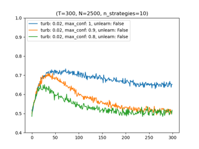

# Simulation Methods - Wiki

[](https://GitHub.com/Naereen/StrapDown.js/graphs/commit-activity)
[](https://lbesson.mit-license.org/)
[](https://www.python.org/)

Simple python package to test simulation methods.

# Getting Started

## Installation :hammer:

```commandline
pip install simmeth
```

## Basic Usage

To set up a simulation simply create an instance of `Simulation` class. In order to run the simulation call `run()` on
simulation object.

```python
from simmeth.simulation import Simulation

env_scenarios = [
    {
        'turb': 0,
        'max_confidence': 1,
        'unlearn': True
    }
]
sim = Simulation(scenarios=env_scenarios, n_strategies=3, t=100, n=100)
sim.run()
```

## Plot Simulation Results

In order to plot simulation results you can call `sim.plot_scenarios()`.



# Change History :arrows_counterclockwise:

## Version 0.0.9
- perform `shock` only when `turb>0`
- 